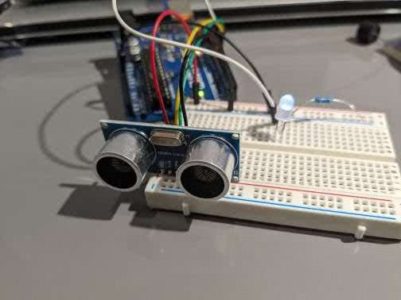

# Distance-Sensor
An Arduino Based Distance sensor

## A Security Device
The Distance sensor is a low cost, effective security system which can alert of intruders instantly.
It uses an Ultrasonic Sensor which sends out a signal and times its return back. Using this it is posibble to accurately determine the distance between objects.
When an object comes within a predefined distance of the sensor, it triggers the Buzzer/Led.

It is also easy to upgrade and change as it is made using an Arduino Uno and a breadboard, you can just replace the LED with a buzzer or vice versa.

